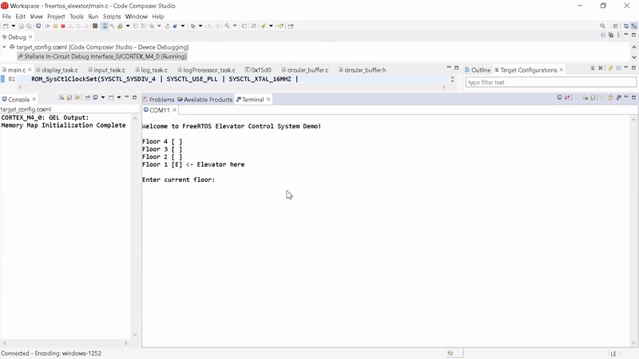

## FreeRTOSElevatorControl

This project implements a task-based elevator control system using FreeRTOS on the TM4C123GXL LaunchPad.

#### System Components
- **Request Handling:** User input for floor requests is captured via SW1 (floor selection) and SW2 (confirmation), ensuring accurate request processing.
- **Elevator Control:** Manages elevator movement based on user requests, determining direction and operation to reach the selected floor.
- **Display Updates:** Real-time updates on the terminal show the elevator’s current floor, movement direction, and status.
- **Log System:** Logs system events, such as floor requests and elevator movements, for debugging and monitoring.

#### Tasks
1. **InputTask:** Captures user floor requests by reading SW1 for floor selection and SW2 for confirmation, passing the input to the elevator control system.
2. **DisplayTask:** Continuously updates the terminal with the current floor, elevator status, and movement direction for real-time feedback.
3. **LogTask:** Logs system activities, such as floor requests and elevator movements, into a circular buffer for monitoring and debugging.
4. **LogProcessorTask:** Processes the logged data, reading it from the circular buffer and displaying it on the terminal for the user to view.

#### FreeRTOS Features Used
- **Tasks:** Enable concurrent execution of system components. Separate tasks manage input handling, display updates, logging, and log processing independently.
- **Semaphore:** Ensures mutual exclusion, granting exclusive access to shared resources like UART for display output and the circular buffer for logging.
- **Queue:** Facilitates inter-task communication, such as transferring floor request data from the Input task to the display and log tasks.
- **Notification:** Tasks signal one another to trigger specific actions. For example, `main.c` notifies the log task to wake up and start logging activities.

#### Demo
View the demo in action.  
